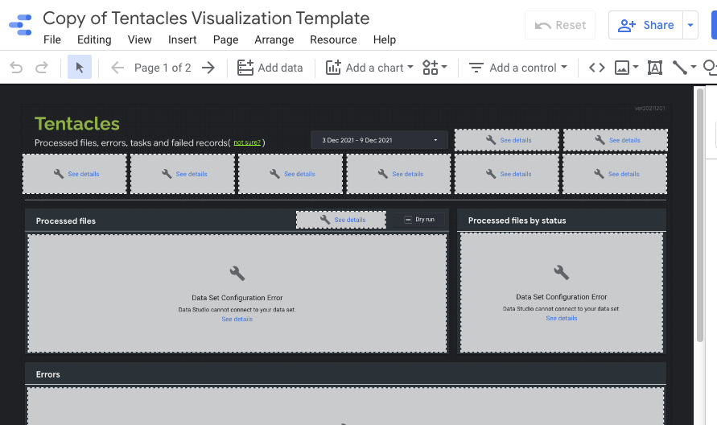
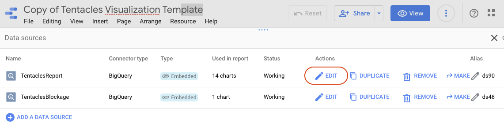
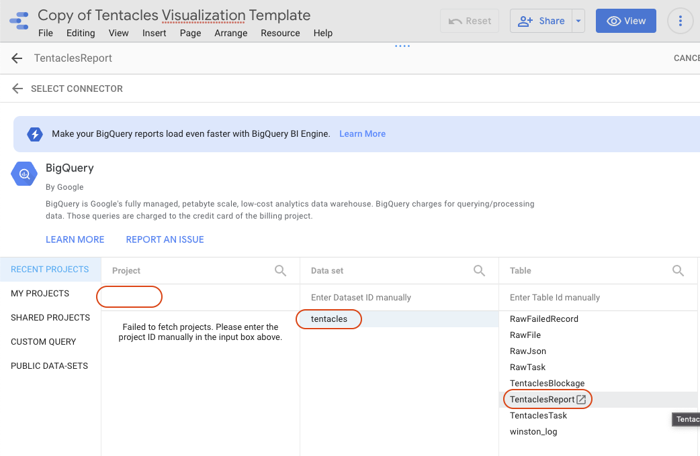
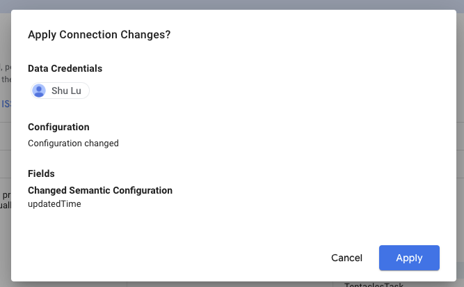
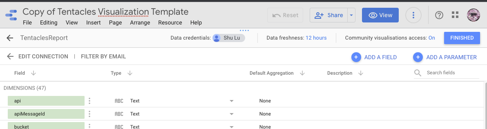
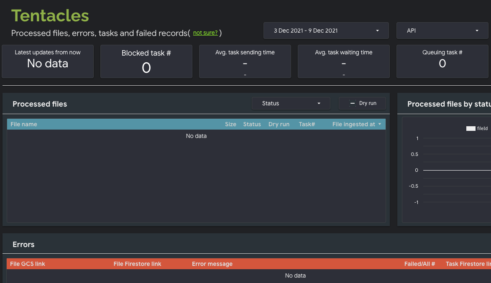

# Reconnect data sources for your Data Studio dashboard

After you have just made a copy of the dashboard, you will have you own dashboard with all tables unavailable because you don't have the access to the connected BigQuery data.

You need to reconnect the data sources to your own BigQuery.

1. Click the Menu `Resource` - `Manage added data sources`
1. Click the `EDIT` under column `Actions` of `TentaclesReport`

1. Input the ID of your Google Cloud Project and select the dataset and table. The table should be `TentaclesReport` here.

1. Click the button `RECONNECT` and confirm by click `Apply` in the popup window.

1. Click the button `FINISHED` in the page and it will go back to the page listing data sources.

1. Repeat the steps for data source `TentaclesBlockage`
1. Click `X Close`, then the button `View`.

Congratulations! You have your own dashboard for your Tentacles instance.

