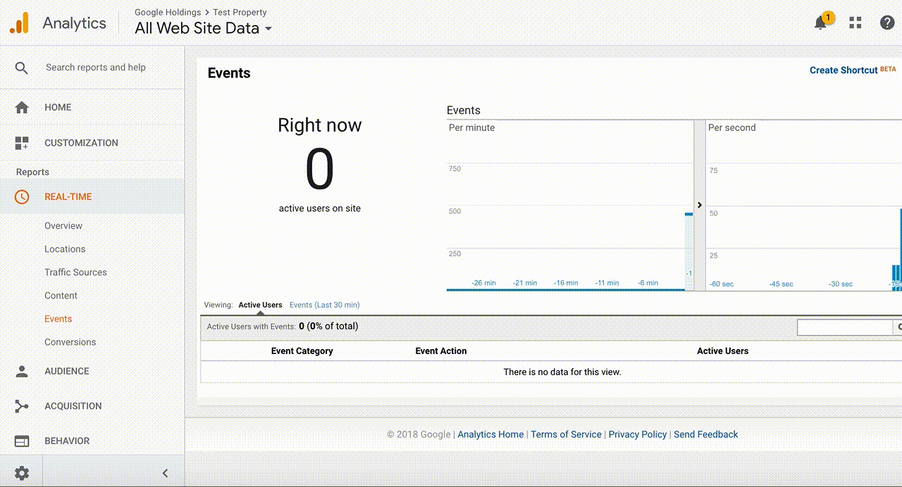

# Connect GA through Measurement Protocol

Conducting more advanced analysis with Google Analytics data in BigQuery is
great in terms of deriving insights. You have the ability to leverage other data
sources to layer on top of your Google Analytics data set like CRM data, weather
or seasonality for example. 

You can use things like [BQML][bqml] to do logistic regression, or leverage open
source libraries like [Lifetimes][lifetimes] to do pLTV or even go as far as
creating your own models on [TensorFlow][tensorflow]. In order to import this
data back into Google Analytics 360 for re-targeting you can adopt one of the
tow methods:

* Data Import
* Measurement Protocol

You still need to build something on top of this to manage the Measurement
Protocol or Data Import when working on a large scale. If you can imagine, you 
will potentially be sending 100K to millions of users back into GA - How do
you manage this effectively with the Measurement Protocol? 

This is where Tentacles comes into place, which solves exactly this problem.

Please have a look here as to [how to deploy Tentacles][deploy_tentacles].

Once this is completed please follow the steps below which covers how to feed data back to Google Analytics via the Measurement Protocol.

[bqml]:https://cloud.google.com/bigquery-ml/docs/bigqueryml-intro
[lifetimes]:https://pypi.org/project/Lifetimes/
[tensorflow]:https://cloud.google.com/solutions/machine-learning/recommendation-system-tensorflow-overview
[deploy_tentacles]:TBD

## Updating the Configuration

To update the configuration for Tentacles to work with your respective Google
Analytics Property, please follow the steps below:

* Start a Cloud Shell instance.
* Change to the Tentacles directory on your Cloud Shell:
```shell script
cd cloud-for-marketing/marketing-analytics/activation/gmp-googleads-connector
```
* Make a copy of the `config_api.json.template` file to put in your own
configuration details:
```
cp config_api.json.template config_api.json
```
* Open the `config_api.json` with a text editor, in this example we will be
using `vim`:
```
vim config_api.json
```
* In this example we will be using events to feed data back into Google
Analytics through Measurement Protocol (for more info click [here
][measurement_protocol]). You can put all the common parameters across all users
into the configuration file such as:
  * **v** - Version of Measurement Protocol
  * **t** - Type of hit, in this case it’s an event
  * **ec** - Event Category, this can typically be a bit generic such as
   Audience Update
  * **ea** - Event Action, this will be a bit more specific as to what we are
   doing such as Clustering
  * **ni** - Specifying that this is a non-interaction event so it won’t impact
   your bounce rate
  * **tid** - this is the Google Analytics property ID
* After you have updated and saved your config file run following script to
synchronize the configuration to Google Cloud Firestore/Datastore. Tentacles
 will pick up the latest configuration automatically.
```
./deploy.sh update_api_config
```
[measurement_protocol]:https://developers.google.com/analytics/devguides/collection/protocol/v1/parameters

##File Format

The file needs to be in JSONL for the Measurement Protocol. As we are sending
data as an event for each user and we have already configured the structure
of the event in the `config_api.json` file. All we need to pass in the export
is the Google Analytics clientId and the Custom Dimension where you will be
passing the additional value you have defined.

In this example we are using clustering, so you will have to create a
[Custom Dimension][custom_dimension] in GA so you can pass which cluster the
user belongs to. Below is an example of what this will look like :
```shell script
{"cid":"219421951.1553051696","cd5":"1"}
{"cid":"171221710.1544538223","cd5":"2"}
{"cid":"219421951.1530516965","cd5":"3"}
{"cid":"171221710.1544538223","cd5":"2"}
```
Cid is referring to the Google Analytics Client ID and CD5 is referring to
Custom Dimension with the index 5.

This file is then exported to the GCS outbound bucket that triggers the
`tentacles_init` function.

[custom_dimension]:https://support.google.com/analytics/answer/2709828?hl=en

##Realtime Reporting

To verify that the hits are coming through correctly, check the realtime
reporting in GA where you can see the data coming in there :


