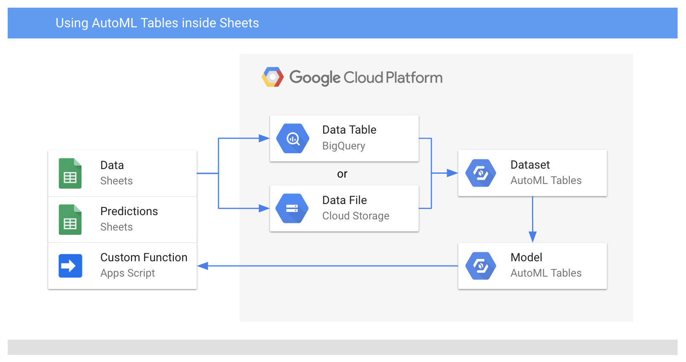

# AutoML Tables in Sheets: A custom function

Sample
[Apps Script](https://developers.google.com/apps-script/)
code for using
[AutoML Tables](https://cloud.google.com/automl-tables/)
within
[Google Sheets](https://www.google.com/sheets/about/),
by defining a custom Sheets function that calls the AutoML Tables API.



## Assumptions

The usage instructions below assume you have already:

- Created a Google Cloud Platform project ([docs](https://cloud.google.com/resource-manager/docs/how-to))
- Trained and deployed an AutoML Tables model ([docs](https://cloud.google.com/automl-tables/docs/how-to))
- Installed and initialized the Google Cloud SDK ([docs](https://cloud.google.com/sdk/docs/how-to))

## Usage

- Open a new or existing sheet in Google Sheets
  - Navigate to [sheet.new](https://sheet.new)
  or [drive.google.com](https://drive.google.com) in your browser
- Open the sheet's script
  - From the sheet, lick "Tools" > "Script editor"
- Copy/paste the code file
  - From the script editor, click "File" > "New" > "Script file"
  - Name the script file `Code.gs` (or any other name you prefer)
  - Copy/paste the contents of `Code.gs` from this directory
- Copy/paste the manifest file
  - From the script editor, click "View" > "Show manifest file"
  - Copy/paste the contents of `appsscript.json` from this directory
- Store an "AutoML Tables Predictor" service account key in a script property
  (see the _Authentication_ section, below)
  - Copy the service account key (from `{` to `}`) to your clipboard
  - From the script editor, click
  "File" > "Project properties" > "Script properties" > "Add row"
  - For the name, type `serviceAccountKey`
  - For the value, paste the service account key
- Use the custom function
  - In the sheet, input a row of test data
  (with the same column order as in your AutoML Tables model)
  into a row of horizontally-adjacent cells, such as `B3:B10`
  - Apply the formula `=predict(B3:B10, T1234567890)` to another cell,
  such as `B1`, but replace `B3:B10` with your cell range
  and `T1234567890` with your AutoML Tables model ID.
  To also get the prediction's confidence,
  apply the formula to two horizontally-adjacent cells.

Note:
[clasp](https://github.com/google/clasp)
is a command-line tool that can automate this process.

## Authentication

This custom function relies on a
[service account](https://cloud.google.com/iam/docs/understanding-service-accounts)
to authenticate its requests to
[the AutoML Tables API](https://cloud.google.com/automl-tables/docs/reference/rest/).
This service account must have the "AutoML Tables Predictor" role.

[Here](https://cloud.google.com/iam/docs/creating-managing-service-accounts)
are instructions for how to create a service account, and
[here](https://cloud.google.com/iam/docs/creating-managing-service-account-keys)
are instructions for how to create a service account key.

Below is a set of CLI commands that will create, configure, and download
a new service account key. If you want to re-use an existing service account,
you may be able to skip some commands.

```sh
FILE=~/my-key.json           # (or any other file path you prefer)
NAME=automl-tables-in-sheets # (or any other name you prefer)
PROJECT=[YOUR PROJECT ID]    # (substitute "[YOUR PROJECT ID]" with your GCP project ID)

# Create a new service account
gcloud iam service-accounts create ${NAME} \
  --display-name ${NAME} \
  --project ${PROJECT}

# Configure the service account
gcloud projects add-iam-policy-binding ${PROJECT} \
  --member serviceAccount:${NAME}@${PROJECT}.iam.gserviceaccount.com \
  --role roles/automl.predictor

# Create and download a key for the service account
gcloud iam service-accounts keys create ${FILE} \
  --iam-account ${NAME}@${PROJECT}.iam.gserviceaccount.com \
  --project ${PROJECT}
```


This service account key
(containing an [RSA private key](https://cloud.google.com/iam/docs/understanding-service-accounts#authentication_using_rsa_private_keys)
for a [user-managed service account](https://cloud.google.com/iam/docs/service-accounts#user-managed_service_accounts))
can be stored either:

- in the sheet,
- in the sheet's [script](https://developers.google.com/apps-script/guides/sheets),
- or in the sheet's [script properties](https://developers.google.com/apps-script/reference/properties/properties-service#getScriptProperties()).

`Code.gs` expects the service account key to be stored in the script
properties, in JSON format, and under the name `serviceAccountKey`.

Note: A sheet's script (and script properties) are visible and editable to
anyone who can edit the sheet.
