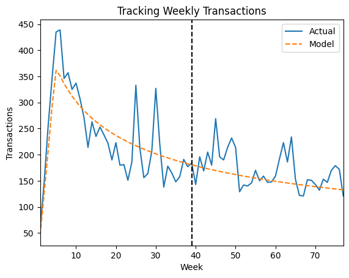
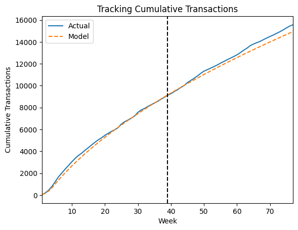

# Future-Customer-Value-Segments (FoCVS)


## Overview

Future-Customer-Value-Segments (FoCVS) is a configurable and privacy-safe
solution for **calculating** and **predicting** customer lifetime value (pCLV)
and **segmenting** customers by total value. It helps advertisers and partners
alike identify their **most valuable** customers and "focus" their marketing
activities on them.

It runs on Google Cloud Dataflow and can be deployed to any Google Cloud
Platform (GCP) project. You can also run it on-prem / off of Google Cloud.

There are two different versions of the pipeline:

* **CSV**: read input data from, and store output as, CSV files in Google
    Cloud Storage (GCS) / on-prem.
* **BigQuery (BQ)**: read input data from, and store output in, Google Cloud
    BigQuery tables.

## Goals

1. Focus on **privacy**; input data does not need to be shared with Google or
any other company.
2. Focus on **flexibility**; users can run the pipeline as many times as they
want, using different input data or different parameters.

## How to use the solution

The solution consists of Cloud Dataflow templates that can be run using
different parameters to customize the execution of the pipeline.
The following steps explain how to install the Cloud Dataflow templates in
a GCP project. Alternatively, the solution can also be run on-prem using Apache
Beam.

### Installation

Note: This solution requires Python >=3.7.

#### GCP Steps

* Navigate to GCP
* Open [Cloud Shell](https://cloud.google.com/shell/docs/using-cloud-shell)
* Set the project in which to install FoCVS by running:

  ```shell
  gcloud config set project <PROJECT_ID>
  ```

* Clone this repo and `cd` into the *future-customer-value-segments* directory
* Execute the installation script, passing in the desired arguments:

  Usage:

  ```shell
  install.sh  [-h] -b=<GCS_BUCKET> [-l=<GCS_LOCATION>] [-r=<DATAFLOW_REGION>]
              [--create_bucket] [--no_install_dependencies]
  ```

  Options:

  ```console
  -h, --help            show this help message and exit
  -b=<GCS_BUCKET>, --bucket=<GCS_BUCKET>
                        name of the Google Cloud Storage bucket to use
  -l=<GCS_LOCATION>, --location=<GCS_LOCATION>
                        location to use for the GCS bucket. E.g. "us" or "EU".
                        Refer to https://cloud.google.com/storage/docs/locations
                        for more information
  -r=<DATAFLOW_REGION>, --region=<DATAFLOW_REGION>
                        region to use for the Dataflow runtime. E.g. "us-central1"
                        or "EUROPE-WEST3". Refer to
                        https://cloud.google.com/dataflow/docs/concepts/regional-endpoints
                        for more information
  -c, --create_bucket   create the GCS bucket specified by <GCS_BUCKET> at the
                        location specifed by <GCS_LOCATION>. Outputs a warning if
                        the bucket already exists
  -n, --no_install_dependencies
                        skip python dependencies installation and reuse the local
                        virtual environment named 'focvs-env' that was created by
                        a previous run of this installation script. This option is
                        ignored if a 'focvs-env' local virtual environment could
                        not be found
  ```

* Close Cloud Shell once the installation completes successfully.

#### GCP Usage

* Go to the Cloud Dataflow page
* Click `+ Create Job From Template`
* Give the job a name and select `Custom Template` under
  `Cloud Dataflow template`
* Insert the desired template (CSV or BQ) GCS path
  (`<your_pipeline_bucket_name>/templates/FoCVS-<csv|bq>`)
* Fill the Required Parameters
* Expand the "Optional Parameters" section if needed

Alternatively, the [Automation Colab Notebook](#automation-colab-notebook) can
be used to simplify this process, particularly for scenarios where several runs
are planned.

#### On-prem Steps

* Clone this repo and `cd` into the *Future-Customer-Value-Segments* directory
* Create a python3 virtual env `virtualenv env`
* Activate the virtual env `source env/bin/activate`
* Install python3 (off-GCP) dependencies `pip install -r requirements_local.txt`
* Prepare your transactional data in CSV format
* Run the solution through the provided `run_locally.sh` after specifying the
  location of your CSV data
* View the output under the newly created `output/` directory
* Deactivate the virtual env `deactivate`

## Data

### Input Data

The pipeline takes input data in the form of a CSV file or BigQuery table
containing customer transactions (the file must contain a header describing the
columns). It must contain the following fields:

* **Customer ID:** an identifier for the customer, can be either a number or a
  string).
* **Date of the transaction:** must be in one of the following formats:
  'YYYY-MM-DD’, 'MM/DD/YY', 'MM/DD/YYYY’, 'DD/MM/YY', 'DD/MM/YYYY’, 'YYYYMMDD').
* **Value of the transaction:** decimal notation (e.g. 123.45).
* **Extra dimension *(Optional)*:** can be a number or a string referring to,
  for example, a category, marketing channel, geographic region or any other
  property of the transaction and/or customer.

Here is an example of input data from the
[CDNow](https://en.wikipedia.org/wiki/CDNow) popular
[transactions dataset](https://www.brucehardie.com/datasets/):

``` csv
customer_id,date,category,sales
00001,1997-01-01,1,11.77
00002,1997-01-12,1,12.00
00002,1997-01-12,5,77.00
00003,1997-01-02,2,20.76
00003,1997-03-30,2,20.76
00003,1997-04-02,2,19.54
```

It is recommended to feed in at least 1 year of transactional
data (ideally 18+ months).

### Output Data

The pipeline generates several files in the output directory.
These files can be divided into two categories, **validation files** and
**prediction reports**:

#### Validation Files

***validation_params.txt***

Contains information regarding the validation of the model. See an example below:

``` txt
Modeling Dates
Calibration Start Date: 1997-01-01
Calibration End Date: 1997-10-01
Cohort Start Date: 1997-01-01
Cohort End Date: 1997-01-31
Holdout End Date: 1998-06-30

Model Time Granularity: Weekly
Frequency Model: BG/NBD

Customers modeled for validation: 7814 (33.25% of total customers)
Transactions observed for validation: 23497 (34.8% of total transactions)

Validation Mean Absolute Percent Error (MAPE): 2.43%
```

***repeat_transactions_over_time.png*** and
***repeat_cumulative_transactions_over_time.png***




Charts that help the user understand how well the model fits the input data.
The vertical lines dissecting the charts represent the difference between the
_calibration_ and _prediction_ periods respectively.

#### Prediction Reports

***prediction_params.txt***

Contains information about the prediction period and the parameters used in the
model. See an example below:

``` txt
Prediction for: 52 weeks
Model Time Granularity: Weekly

Customers modeled: 23502
Transactions observed: 67511

Frequency Model: BG/NBD
Model Parameters
r: 0.26805064950507473
alpha: 5.991516710871457
a: 0.4901959576295743
b: 2.1372211217801924

Gamma-Gamma Parameters
p: 7.676093116272801
q: 3.6321332914686537
v: 11.435020413203247
```

***Prediction CSV Files (or BigQuery tables)***

* **prediction_summary.csv**: predictions grouped by segment (useful to
  identify the customer segment that provides the most value).
* **prediction_summary_extra_dimension.csv**: predictions grouped by extra
  dimension.
* **prediction_by_customer.csv**: prediction for each input customer.

The following columns within those files contain the model prediction output
data for the duration of the prediction period (one year by default):

* **Probability Alive** (p_alive): Likelihood that a customer has not churned
* **Predicted Purchases** (predicted_purchases): Predicted number of purchases
* **Predicted Average Order Value** (future_aov): Predicted average monetary
  value per order
* **Total Customer Value** (expected_value): Predicted future spend. This is
  analogous to `predicted_purchases * future_aov`

Including the probability that a customer has not churned into the _Total
Customer Value_ equation yields a more accurate pCLV score: `p_alive *
expected_value`.

## Automation Colab Notebook

The [focvs_automation.ipynb](focvs_automation.ipynb) notebook is a
[Google Colaboratory](https://colab.research.google.com/) notebook that can be
used to automate running the pipeline without using the GCP UI. This notebook is
particularly useful when there is a need to run the pipeline several times with
different parameters (e.g. multiple extra dimensions, different calibration
and/or cohort dates, etc.) - a process which is quite time-consuming and
error-prone if done through the GCP Dataflow UI.
